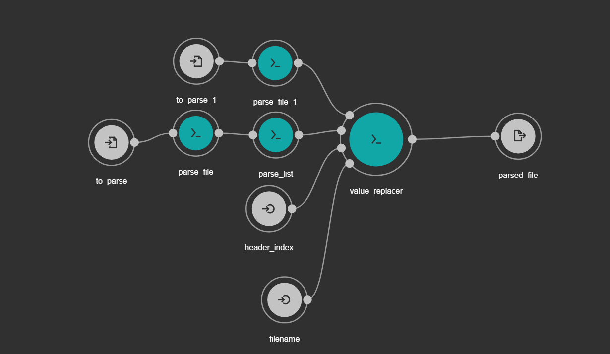

Workflows
=============

CSV Combiner Workflow
^^^^^^^^^^^^^^^^^^^^^

Allows a user to combine numerical values in rows with a specificed tag.

   
Inputs:
"""""""""
* Yaml file specifying input
	* Original CSV file to sum
	* Index of tag 
	* Desired filename
	* CSV file that maps value to sum to identification value
         * Column 1: value to replace (values separated by a semicolon)
	 	 * Column 2: replacement value (must also be a value in column_1) 
Outputs:
"""""""""
Summed CSV file

Usage:
""""""
Run command:

> cwl-runner sum_csv.cwl input_file.yml